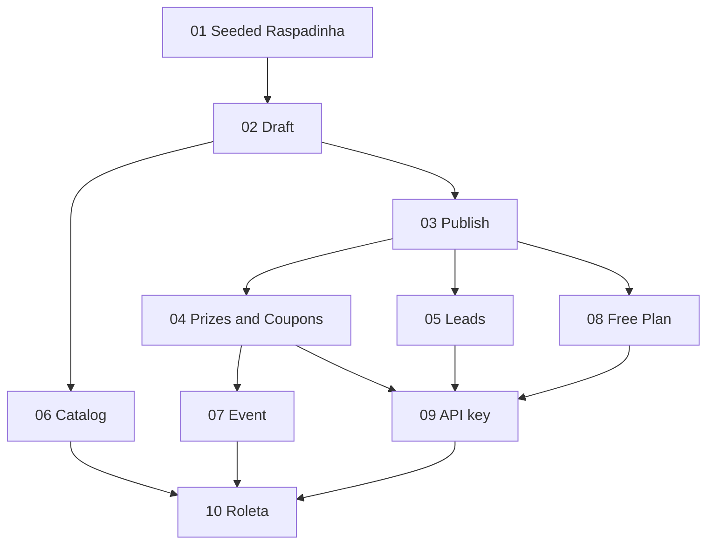

# Promo experiences MVP

**Status:** ready-for-agent

Working title of the product: **Raspa**. The brand is provisional. The glossary terms do not depend on it.

Tickets: `.scratch/promo-experiences/issues/`.

## Problem Statement

A business that wants a promotional raspadinha today asks someone to hand-build a page. This repository is that page for Calais Churros: a header, a scratchable cover, a single baked-in prize ("Você ganhou 50% OFF nos churros tradicionais"), a validity line, and a footer that tells the person to show the coupon in a physical store. There is no account, no second prize, no contact capture, and no way for another business to publish their own version.

Marketing teams want to launch this kind of page themselves. Software entrepreneurs want their own product to create the same pages through an API. In both cases the thing they share is one public page. People who open it should be able to play, receive a coupon or an invitation, and leave their contact so the business can follow up.

A general presentation tool (the comparison in planning was Genially) solves a wider problem than this. The job here is a catalog of small promotional interactions, starting from raspadinha and roleta, with room for many more later.

## Solution

A Member signs in to the Studio, picks a Template from the Catalog, fills in brand, copy, Prizes, and an optional lead form, and publishes one Experience. Visitors open the Share URL on a phone, play, and see a Reveal. The Organization reads Leads in the Studio or through an API key. The API uses the same rules as the Studio.

The MVP Catalog has two playable Templates:

- **Raspadinha**, whose layout follows the Calais page: header, interaction frame, instruction, validity, footer, then the Reveal.
- **Roleta**, which replaces the frame with a wheel and keeps the rest of that page.

Five further Templates are visible and cannot be started: Caixa de presente, Quiz, Memória, Grade da sorte, and Slot. They exist so the Catalog is a list of interactions, not a single hardcoded screen. Dozens more are later tickets with the same shape as Roleta. This plan does not build them.

The free Plan allows one published Campaign at a time, and any number of drafts. Billing, extra Members, custom domains, and three-dimensional Prizes are later plans. The later 3D plan is sketched under Further Notes so it has a place to land without entering these tickets.

The seeded Experience reproduces the Calais promotion, including its artwork and its Portuguese copy, so the first Template is checked against a real page. The original static files stay in the repository as the visual reference.

## User Stories

1. As a Member, I want to create an Organization with my name, email, and password, so that I can start a promotion on my own.
2. As a Member, I want to sign in and return to the Studio, so that I can continue a Campaign I already started.
3. As a Member, I want to sign out, so that a shared computer does not keep my Studio open.
4. As a Member, I want the Studio in Portuguese (Brazil), so that I can set up a promotion in the language I use with Visitors.
5. As a person opening the product for the first time, I want a home page that says I can create a promotional page and share it, so that I know where to start.
6. As a Member, I want the Studio to open on a Catalog of Templates, so that I start from an interaction the product already knows how to run.
7. As a Member, I want Raspadinha marked as available, so that I can recreate a scratch promotion.
8. As a Member, I want Roleta, Caixa de presente, Quiz, Memória, Grade da sorte, and Slot visible before they are all playable, so that I can see the product is a catalog.
9. As a Member, I want to start a Campaign from an available Template, so that the Studio asks only for that Template's fields.
10. As a Member, I want to set the Campaign name and the slug of the Share URL, so that the public address is readable.
11. As a Member, I want to upload a logo and a header image, so that the Experience carries my brand.
12. As a Member, I want to set the background, text, accent, and Cover colors, so that the page matches my brand.
13. As a Member, I want to write the headline, the instruction, the validity line, and the footer, so that the legal and promotional copy is mine.
14. As a Member, I want to save a draft and come back to it, so that I can finish the promotion in more than one sitting.
15. As a Member, I want to run a Preview Play, so that I can see the Experience before anyone else can.
16. As a Member, I want a Preview Play to avoid issuing a Coupon or storing a Lead, so that a rehearsal does not empty the prize pool or pollute my contacts.
17. As a Member, I want to publish a Campaign, so that Visitors can open the Share URL.
18. As a Member, I want to copy the Share URL and download a QR code, so that I can put the promotion on a counter, a story, or a receipt.
19. As a Member, I want to edit copy and theme on a published Campaign, so that I can fix a typo without changing the Share URL.
20. As a Member, I want an existing Play to keep its Outcome after I edit the Campaign, so that a Visitor who already revealed a Coupon still has that Coupon.
21. As a Member, I want to unpublish a Campaign, so that new Visitors can no longer start a Play.
22. As a Visitor who already has a Play, I want the Share URL to keep showing my Outcome after unpublish, so that I can still show the Coupon in the store.
23. As a Member on the free Plan, I want a clear refusal when I try to publish a second Campaign, so that I understand the limit.
24. As a Member, I want to keep extra drafts while one Campaign is published, so that I can prepare the next promotion.
25. As a Member, I want unpublishing to free the publish slot, so that I can publish a different Campaign.
26. As a Member, I want several Prizes, each with a label, a weight, and artwork, so that Visitors do not all receive the same reward.
27. As a Member, I want a Prize to issue Coupons from a list I provide, so that my store can honor codes it already knows.
28. As a Member, I want the product to generate Coupon codes when I have no list, so that I can launch without a spreadsheet.
29. As a Member, I want a Prize that shows only a message, so that a Visitor can "not win" without receiving a code.
30. As a Member, I want a Prize to be an Event with a title, a time, a place, and a link, so that the Reveal can invite the Visitor to something the business is doing.
31. As a Member, I want each issued Coupon tied to one Play, so that two Visitors never receive the same code.
32. As a Member, I want to see which Coupons are available, issued, and redeemed, so that I know what the store still has to honor.
33. As a Member, I want to mark an issued Coupon as redeemed, so that the counter can record that the prize was handed over.
34. As a Member, I want an exhausted Coupon pool to stop awarding that Prize, so that I never show a win with no code.
35. As a Visitor, I want to open a Share URL on my phone without an account, so that the promotion is one tap from a QR code or a story.
36. As a Visitor, I want to see the brand, the instruction, and the validity before I play, so that I know what the promotion is.
37. As a Visitor on a Raspadinha, I want to scratch the Cover with my finger, so that it feels like a paper card.
38. As a Visitor on a computer, I want to scratch with a mouse, so that the same Share URL works on desktop.
39. As a Visitor, I want the page to stay still while I scratch, so that the browser does not steal the gesture.
40. As a Visitor, I want the prize to stay covered until I have cleared enough of the Cover, so that the scratch is the moment of the promotion.
41. As a Visitor who cannot use a pointer, I want a control that Reveals the prize, so that the promotion is available without the gesture.
42. As a Visitor, I want a short Reveal animation, so that the result feels like an event.
43. As a Visitor who prefers reduced motion, I want the prize to appear immediately, so that the animation is not forced on me.
44. As a Visitor, I want to see only my Outcome, so that the odds and the other Prizes stay with the business.
45. As a Visitor who reloads, I want the same Outcome, so that I do not draw a second Coupon.
46. As a Visitor, I want the Experience to show the Campaign's brand and none of the Studio navigation, so that the page feels like the business's own.
47. As a Visitor who opens an unknown slug, I want a simple not-available page, so that I do not see another Organization's draft.
48. As a Visitor who arrives after unpublish and has no Play yet, I want the same not-available page, so that a finished promotion stops quietly.
49. As a Member, I want to turn lead capture on or off, so that a pure Reveal does not force a form.
50. As a Member, I want to choose whether name, email, and phone are hidden, optional, or required, so that I only ask for what the store will use.
51. As a Member, I want to write the consent sentence, so that the Visitor agrees to be contacted about this promotion.
52. As a Visitor, I want the form after the Reveal, so that I already know why I am handing over my contact.
53. As a Visitor, I want a submission without consent to be refused, so that I am not stored by accident.
54. As a Member, I want Leads listed with the Outcome of their Play, so that I know what that person won.
55. As a Member, I want to download those Leads as a CSV, so that I can open them in a spreadsheet or import them into a tool I already use.
56. As a Member, I want counts of Plays, Reveals, and Leads, so that I can tell whether the Share URL is working.
57. As a Member, I want to create an API key that is shown in full only once, so that my software can act for the Organization.
58. As a Member, I want to revoke an API key, so that a leaked key stops working.
59. As a Member with an API key, I want to create a Campaign, set Prizes and the lead form, publish, and receive the Share URL, so that a promotion can be launched without the Studio.
60. As a Member with an API key, I want to list Leads and the same counts the Studio shows, so that I can connect the promotion to another system.
61. As a Member with an API key, I want the same publish, Plan, draw, and consent rules as the Studio, so that there is one product behind both doors.
62. As a Member, I want a missing or revoked API key to be rejected, so that Campaigns are not open to anonymous writes.
63. As a Visitor on a Roleta, I want to spin a wheel whose segments are the Prize labels, so that the business can run a second kind of promotion.
64. As a Visitor on a Roleta, I want the wheel to stop on the Outcome the server already drew, so that the animation and the Coupon match.
65. As a Member, I want Roleta to reuse Coupons, Events, messages, Leads, the Share URL, the Preview Play, and the Plan, so that the second Template is not a second product.
66. As a Member looking at the Calais example, I want a seeded Experience with that campaign's artwork and copy, so that Raspadinha is checked against the original page.

## Implementation Decisions

The repository today is the static Calais page (HTML, one canvas script, CSS, artwork, and the Rabie font files used by that page). Ticket 01 introduces the app toolchain, Postgres, and the HTTP server. That work lives inside the first tracer bullet because there is no product shell yet.

### Stack

- One Vite + TypeScript app. React hosts the signed-out home, the Studio, and a thin Experience shell. See ADR-0001 and ADR-0002.
- Tailwind styles the Studio. Aceternity components, copied in as source for the pieces we use, supply the Studio and the home page, including their motion.
- The Template runtime is plain TypeScript. The host calls `mount` and receives progress from 0 to 1. Raspadinha reports scratch progress. Roleta reports 1 when the spin animation reaches the winning segment.
- The Experience uses the Campaign theme. Studio chrome strings are pt-BR. A single dictionary module holds them so an English Studio can be added later without a new framework. Campaign copy is whatever the Member typed.
- The platform font stack is an open font. Rabie stays available to the seeded Calais Campaign only. It is not a font other Organizations can select. Members choose from a short list of open faces. Uploading a custom font is out of this plan.
- Postgres is the system of record. Tests run against Postgres.
- Uploaded images (logo, header, prize artwork) go through a storage port. The first adapter is the local disk of a single instance, limited to PNG, JPEG, and WebP, at most 2 MB each. Object storage is a later adapter.
- Passwords are stored with a slow hash. Sessions are httpOnly cookies. An API key is stored as a hash and shown in full once.
- No third-party analytics script on the Experience. Counts come from Plays, Reveals, and Leads.

### Reference behavior worth keeping, and behavior worth dropping

Keep from the Calais page: a column layout, a header, a framed interaction, the instruction "Raspe aqui", a validity line, a footer with redemption instructions, finger and mouse scratching, and a Cover drawn over prize artwork.

Drop from the Calais script: logging every pointer event, a brush size in raw pixels, separate coordinate math for mouse and touch, and a prize that is only a static image with no completion. The brush is 18% of the shorter side of the interaction frame. Reveal unlocks when 45% of the Cover is cleared, or when the Visitor uses the reveal control. Both pointer types share one coordinate path. `touch-action` on the frame stops the page from scrolling while scratching.

The seeded Campaign uses the existing Calais artwork and this copy:

- Headline meaning: "Agora somos Calais churros e temos presente pra você!"
- Instruction: "Raspe aqui"
- Validity: "Promoção válida até 30/11/2023"
- Footer: "Apresente esse cupom em uma de nossas lojas físicas para receber o seu presente."
- Prize: "Você ganhou 50% OFF nos churros tradicionais. Aproveite!"
- Theme: background `#ed6b6e`, text `#fff9e5`, accent `#f9de7e`, Cover `#3f3e3e`

The seed has one Prize, weight 1, whose action is a message with that prize sentence. The original page never minted a unique code; the footer still tells the Visitor to present the page in a physical store, and the Outcome is a message. Coupon pools start when a Member configures them.

### Modules

- **Campaign service**, reached only through the HTTP API. It creates Campaigns, publishes, draws Outcomes, issues Coupons, and stores Leads.
- **Template registry.** It maps a Template id to a runtime and to the Studio fields. Unknown ids are refused.
- **Experience host.** It loads the public payload and mounts the runtime.
- **Studio.** It is a client of the HTTP API.
- **File storage port.** It is used by the API when a Member uploads an image.

### Campaign shape

These shapes are the contract. They are not code from the Calais prototype.

```ts
type CampaignStatus = "draft" | "published"

type OutcomeAction =
  | { type: "coupon"; source: "pool" | "generated" }
  | { type: "event"; title: string; startsAt: string; location: string; url: string }
  | { type: "message"; body: string }

type Prize = {
  label: string
  weight: number // positive integer
  artworkUrl: string | null
  action: OutcomeAction
}

type LeadField = "off" | "optional" | "required"

type LeadForm = {
  enabled: boolean
  name: LeadField
  email: LeadField
  phone: LeadField
  consentText: string
}
```

A Campaign also holds: Organization id, Template id, name, slug, status, theme colors, logo, header image, headline, instruction, validity, footer, font choice, Prizes, and lead form.

Slug rules: lowercase letters, digits, and hyphens, unique across all Organizations, so the Share URL can be short. The public path is `/e/{slug}`.

Publish requires a slug, a headline, an instruction, and at least one Prize. The free Plan refuses a second Campaign in `published` status for that Organization. Unpublishing returns the Campaign to draft and frees the slot.

Editing copy, theme, and images on a published Campaign affects future Plays. The Outcome already stored on a Play stays.

### Play lifecycle

1. The Visitor opens `/e/{slug}`.
2. The client starts a Play and sends the visitor key from a cookie when it has one. The cookie is scoped to the Experience.
3. If that key already has a Play on this Campaign, the service returns it. Otherwise it draws an Outcome and stores the Play.
4. The host mounts the Template.
5. On threshold, reveal control, or the start of a Roleta spin, the client calls Reveal.
6. The service returns the Outcome action and, when the form is enabled, the lead form.
7. A Lead submission is stored only with consent, and only for a revealed Play that is not a Preview Play.

A visitor key is an opaque random id. Clearing site data can start another Play. Stronger identity is out of scope.

Draw: take a random integer in `0 .. sum(weights) - 1` and walk the Prizes. If the drawn Prize is a coupon Prize and no code is left, draw again among Prizes that can still be awarded (a message Prize, an Event Prize, or a coupon Prize with a code remaining). If none can, store a fallback message Outcome ("Os prêmios desta promoção se esgotaram.") and do not issue a code. Weights never leave the server.

Roleta receives every Prize label at play start so the wheel can be drawn, and receives the winning index at Reveal. The client animates to that index. It does not choose the index.

### HTTP contract

Session cookie for the Studio. `Authorization: Bearer` API key for the developer paths. Same handlers.

Public:

- `POST /api/e/{slug}/plays` starts or returns the Play.
- `POST /api/plays/{id}/reveal` returns the Outcome for that visitor key.
- `POST /api/plays/{id}/lead` stores a Lead.

Play start response (not yet revealed):

```ts
{
  playId: string
  template: "raspadinha" | "roleta"
  theme: { background: string; text: string; accent: string; cover: string }
  logoUrl: string | null
  headerImageUrl: string | null
  headline: string
  instruction: string
  validity: string
  footer: string
  artworkUrl: string | null // the drawn Prize only
  segments: { label: string }[] | null // Roleta only
  alreadyRevealed: false
}
```

Reveal response adds `prizeLabel`, `action` (`coupon` with `code`, `event` with its fields, or `message` with `body`), and `leadForm` or `null`. A Play that was already revealed returns this same body from play start, with `alreadyRevealed: true`, so a reload can render the Outcome without a second draw.

Studio and API key, same rules either way:

- Create and update a Campaign, including Prizes and the lead form.
- Upload an image.
- Publish and unpublish.
- List Coupons and mark one redeemed.
- List Leads, download CSV, read counts (`plays`, `reveals`, `leads`).
- Create and revoke API keys.
- Preview: a Play flagged as preview. The reveal uses a sample code string `PREVIEW` when the action is a coupon, and it does not consume a pool code.

Status codes: `401` for a missing or bad session or API key, `404` for an unknown slug or a published-only route hit by a new Visitor after unpublish, `422` for validation and for the Plan limit. A Visitor who already has a Play still receives that Play from the public play route after unpublish.

Generated Coupon codes use a short prefix plus an alphabet that omits `0`, `O`, `1`, and `I`.

### What the first release is allowed to look like

The signed-out home and the Catalog use Aceternity motion. The Experience Reveal is a short CSS animation that reduced motion skips. The Raspadinha frame is the focus of the public page; the Studio does not need a general animation system.

The original Calais `index` page remains in the repo until a human removes it. Ticket 01 does not delete it.

## Testing Decisions

A good test exercises the product from the HTTP API. It creates a Campaign, publishes it, starts a Play, reveals it, and submits a Lead, then asserts the JSON a client would see. It does not query tables, and it does not screenshot the canvas. The Calais page has no test suite to extend; this API suite is the first one.

The module under test is the HTTP API in ADR-0004. Gesture quality (brush feel, 45% threshold, no scroll while scratching) is checked by a person on a phone-sized viewport as part of finishing the Raspadinha and Roleta tickets. If pointer math is extracted, it may have a tiny unit test, and the HTTP suite still does not depend on it.

Every ticket extends this same suite with the behavior that ticket makes true. New test files that bypass the API to insert Prizes or Leads are a miss against ADR-0004.

## Out of Scope

- A freeform page builder, arbitrary blocks, or a timeline editor in the style of Genially.
- Templates beyond Raspadinha and Roleta. The five named placeholders have no runtime.
- Three.js, Meshy, or any 3D Prize. The later plan is described below so it is not built early.
- Billing and paid Plans. The free Plan is a limit enforced in the API, with no payment provider.
- More than one Member per Organization, roles, and invites.
- Custom domains, and embedding the Experience in an iframe.
- OAuth, email verification, and password-reset mail.
- Per-Campaign UI locale. Chrome on the Experience is pt-BR; long copy is the Member's text.
- Uploading a proprietary font, and offering Rabie to Organizations other than the seeded example.
- Webhooks, CRM connectors, and Zapier. CSV and the Lead list API are the connection in this plan.
- Email or SMS delivery of Coupons.
- Third-party analytics, pixels, and ad attribution.
- Anti-cheat beyond withholding codes and weights. Inspecting the single prize image is accepted.
- Age gates, geofencing, and a compliance engine for sweepstakes or lotteries. See ADR-0006.
- Object storage, more than one app instance, and a CDN. The first storage adapter is local disk.
- QR codes that are anything other than a downloadable image of the Share URL.
- Migrating the historical Calais page off its static files. The seed coexists with it.

## Further Notes

### Seam

The test seam is the HTTP API (ADR-0004). It was fixed in this spec so the plan could be published in one pass. If browser tests should be the gate instead, say so before implementation of ticket 01 and update ADR-0004. A second seam for the canvas would split the suite the ADRs are trying to keep whole.

### Tracker

Tickets are local markdown under `.scratch/promo-experiences/issues/` because this planning pass records the work in git. Status on each ticket is `ready-for-agent`.

### Skill

This spec follows the `to-spec` skill (the successor of `to-prd` in mattpocock/skills). The tickets follow `to-tickets`: vertical slices, each blocked by the tickets that actually gate it.

### Order

An arrow means "blocks". `01` can start immediately. After that, the frontier is any ticket whose blockers are all done.



1. Play the seeded Raspadinha.
2. Sign up and save a draft. Depends on 01.
3. Publish, share, QR, unpublish. Depends on 02.
4. Weighted Prizes and Coupons. Depends on 03.
5. Leads, CSV, counts. Depends on 03.
6. Catalog, including placeholders and Studio motion. Depends on 02.
7. Event Outcome action. Depends on 04.
8. Free Plan publish limit. Depends on 03.
9. Developer API. Depends on 04, 05, and 08.
10. Roleta. Depends on 06, 07, and 09.

Numbers here are the story of the order. File numbers in `issues/` match this list.

### Later plan: Meshy and Three.js

After this MVP, a Prize can carry a generated model. A Member describes an object in the Studio. The product calls the Meshy API, stores the asset through the same storage port, and the Experience runtime mounts a Three.js view at Reveal. Play, Outcome, Coupon, and Lead stay as they are. The Studio does not become a 3D editor. That work needs its own spec and its own tickets; it is not `ready-for-agent` here.

### Later plan: a long Catalog

Each new Template is a ticket shaped like Roleta: Catalog entry becomes available, runtime mounts, Prizes and Leads behave as they already do, HTTP tests cover a Play. Candidates already named in the Catalog: Caixa de presente, Quiz, Memória, Grade da sorte, Slot. Webhooks on a new Lead, a paid Plan, extra Members, and a custom domain for the Share URL are product plans of the same kind: one seam, the HTTP API, extended.

### Maintainability

The risk in this product is baking Raspadinha into the Campaign rules. The draw, the Coupon pool, the Lead, and the Plan limit are Template-agnostic on purpose. Roleta is in the MVP to force that split while the code is still small. Media can grow later (an image today, a Meshy model later) as a field on the Prize, beside the label and the Outcome action.

The static Calais page is a fixture and a visual oracle. It should not grow new features. New behavior lands in the product app.
